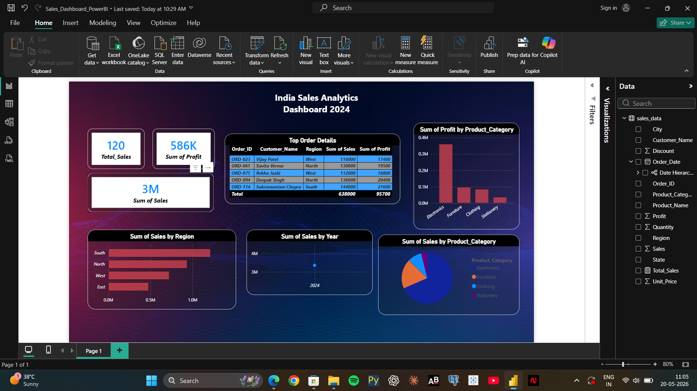

# 📊 India Sales Analytics Dashboard 2024

A complete **Sales Analytics Dashboard** built using **Microsoft Power BI Desktop**, analyzing retail sales data across India for the year 2024.

---

## 🖼️ Dashboard Preview



---

## 🎯 Project Overview

This project analyzes **120 sales transactions** across 4 regions of India — North, South, East, and West — covering product categories like Electronics, Furniture, Clothing, and Stationery.

The goal was to build an interactive dashboard that helps business stakeholders quickly understand:
- Where sales are coming from
- Which products and categories are most profitable
- How sales trend over time
- Who the top customers are

---

## 📁 Project Structure

```
Sales-Dashboard-PowerBI/
│
├── India_Sales_Dashboard.pbix   # Power BI Dashboard File
├── sales_data.csv               # Raw Dataset (120 records)
├── dashboard_screenshot.png     # Dashboard Preview Image
└── README.md                    # Project Documentation
```

---

## 🛠️ Tools Used

| Tool | Purpose |
|------|---------|
| Microsoft Power BI Desktop | Dashboard & Visualizations |
| Power Query | Data Cleaning & Transformation |
| DAX | Calculated Measures |
| CSV | Raw Data Source |

---

## 📊 Dashboard Visuals

| Visual | Type | Description |
|--------|------|-------------|
| Total Orders | Card | Count of all orders (120) |
| Total Sales | Card | Sum of all sales (₹3M+) |
| Total Profit | Card | Sum of all profit (₹586K) |
| Sales by Region | Bar Chart | North vs South vs East vs West |
| Sales by Year | Line Chart | Monthly/Yearly trend |
| Sales by Category | Pie Chart | Electronics, Furniture, Clothing, Stationery |
| Profit by Category | Bar Chart | Net profit per category |
| Top Orders Table | Table | Top 5 orders by sales value |

---

## 🔍 Key Insights

- 📍 **South Region** leads in total sales followed by North
- 💻 **Electronics** is the top-performing category by both sales and profit
- 📅 **Q4 (Oct–Dec)** shows highest sales — festival season effect
- 🏆 **Top Order** — ORD-114 by Subramaniam Chopra (₹1,44,000)
- 💰 **Average Order Value** — ₹23,750 per transaction
- 📦 **120 orders** processed across **4 regions** and **10+ cities**

---

## 📂 Dataset Details

| Column | Description |
|--------|-------------|
| Order_ID | Unique order identifier |
| Order_Date | Date of transaction (Jan–Dec 2024) |
| Customer_Name | Customer full name |
| Region | North / South / East / West |
| State | Indian state |
| City | City of order |
| Product_Category | Electronics / Furniture / Clothing / Stationery |
| Product_Name | Specific product |
| Quantity | Units ordered |
| Unit_Price | Price per unit (₹) |
| Sales | Total sale amount (₹) |
| Discount | Discount applied (0%, 5%, 10%) |
| Profit | Net profit (₹) |

---

## 🚀 How to Use

1. Clone or download this repository
2. Open `India_Sales_Dashboard.pbix` in **Power BI Desktop**
3. If data doesn't load — go to **Transform Data** → update file path of `sales_data.csv`
4. Explore the dashboard — use filters and slicers to interact!

---

## 👨‍💻 About

Built as a **Data Analyst Portfolio Project** to demonstrate skills in:
- Data importing and cleaning
- Visual design and storytelling
- Business insight extraction
- Power BI dashboard development

---

## 📬 Connect

Feel free to connect or give feedback!

> ⭐ If you found this helpful, give the repo a star!
